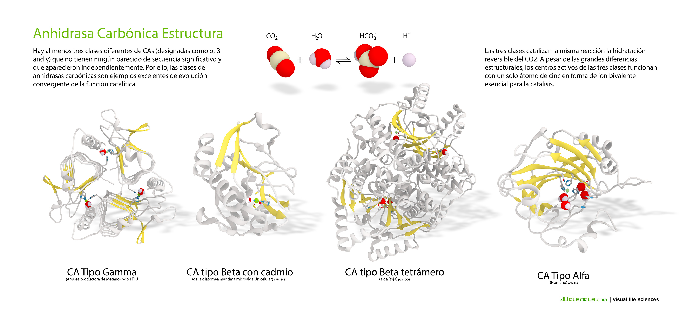
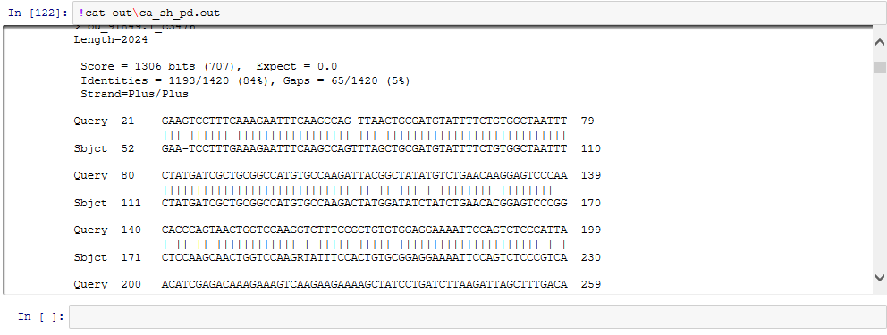

# My favorite gen
##Carbonic Anhydrase (CA)

There are at least five distinct CA families (α, β, γ, δ and ε). With polyphyletic origin (vertebrates, invertebrates, bacteria, and some chlorophytes). 
 

	Carbonic anhydrases are zinc-containing enzymes that catalyze the reversible hydration of carbon dioxide in a two-step mechanism: a nucleophilic attack of a zinc-bound hydroxide ion on carbon dioxide, followed by the regeneration of the active site by ionization of the zinc-bound water molecule and removal of a proton from the active site. They are ubiquitous enzymes involved in fundamental processes like photosynthesis, respiration, pH homeostasis and ion transport. There are three evolutionary distinct groups - alpha, beta and gamma carbonic anhydrases - which show no significant sequence identity or structural similarity. Most alpha CAs are monomeric enzymes. The zinc ion is complexed by three histidine residues and a fourth conserved histidine plays a potential role in proton transfer. 

####**Carbonic anhydrase in corals**
___

Carbonic anhydrases play an important role in biomineralization in corals. Biomineralization is a fundamental proces for coral reefs formation.

	Schematic model proposed for the function of CA in the calcification process. During the light, protons produced by calcification are titrated by the alkaline environment because of the photosynthetic process, which facilitates CO2 diffusion and thus calcium carbonate precipitation. During the dark, protons are not titrated and tend to be accumulated in the subcalicoblastic space and the surrounding tissues, which decrease CO2 diffusion from calicoblastic cells and thus calcification. We suggest that an up-regulation of STPCA expression during the dark allows coping with night acidosis (Moya et al. 2008).

####CA families have no significant amino acid sequence similarity and in most  cases are thought to be an example of convergent evolution.
---

There is no gene sequence of CA *P. damicornis* annotated in the gen Bank. But it is a transcriptomic database of the specie (you can get access to the data-abase [here](http://cnidarians.bu.edu/PocilloporaBase/cgi-bin/index.cgi)).

**Can we find carbonic anhydrase of three coral species (Pocilloporidae) in the  *Pocillopora damicornis* transcriptome?**

____

#Results
##

This  is the results of blast for *Stilophora pistillata* (CA):

This  is the results of blast for *Stilophora pistillata* (CA2):

This  is the results of blast for UNVERIFIED: *Seriatopora hystrix* clone ShD-E12 carbonic anhydrase-like: *Stilophora pistillata*

___

Thus, we can assume that *P. damicornis* database have CA sequences (these can be found [here](http://cnidarians.bu.edu/PocilloporaBase/cgi-bin/pdpfsearch.cgi))

Then, we can do a blast of our hypothetical *P. damicornis* (CA) in GENBAK

Finally we can see the [Conserved domains](http://www.ncbi.nlm.nih.gov/Structure/cdd/wrpsb.cgi?RID=2JF3TNG801R&mode=all)

 

